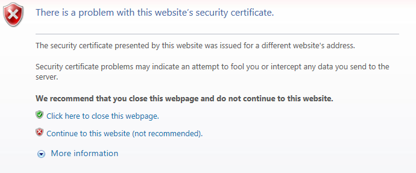

Nginx - 使用OpenSSL自签名证书配置HTTPS
===
#OpenSSL生成证书
* 创建Key
* 创建签名请求（CSR）
* 移除口令
* 签署证书（或发给CA机构认证）
```
# Generate an RSA key
openssl genrsa -des3 -out Server.key 1024

# Creating Certificate Signing Requests
# 需要输入组织信息，留空输入点(.)，而非直接回车（用缺省值）
openssl req -new -key Server.key -out Cert.csr

# 移除口令
cp Server.key Server.key.org
openssl rsa -in Server.key.org -out Server.key

# Signing Your Own Certificates
openssl x509 -req -days 365 -in Cert.csr -signkey Server.key -out Cert.crt
```

# Nginx SSL配置
确保`http_ssl_module`已安装。

否则会报错：[nginx: [emerg] the "ssl" parameter requires ngx_http_ssl_module]()

```
$ sudo nginx -V
nginx version: nginx/1.16.1
built by gcc 4.8.5 20150623 (Red Hat 4.8.5-36) (GCC)
built with OpenSSL 1.0.2k-fips  26 Jan 2017
TLS SNI support enabled
configure arguments: --with-http_stub_status_module --with-http_ssl_module
```

加ssl配置。

```
sudo vi /usr/local/nginx/conf/nginx.conf
```
```conf
        listen       443 ssl;
        server_name  192.168.1.88;

        ssl_certificate /user/local/nginx/cert/Cert.crt;
        ssl_certificate_key /user/local/nginx/cert/Server.key;
```
# 开443端口
```
sudo firewall-cmd --list-all

sudo firewall-cmd --zone=public --add-port=443/tcp --permanent
sudo firewall-cmd --zone=public --remove-port=443/tcp --permanent
sudo firewall-cmd --reload
```
# 测试

提示是一个有问题的证书（因为是自己签名的）。

https://192.168.1.88



# 参考

https://www.feistyduck.com/library/openssl-cookbook/online/ch-openssl.html
https://nginx.org/en/docs/http/ngx_http_ssl_module.html
