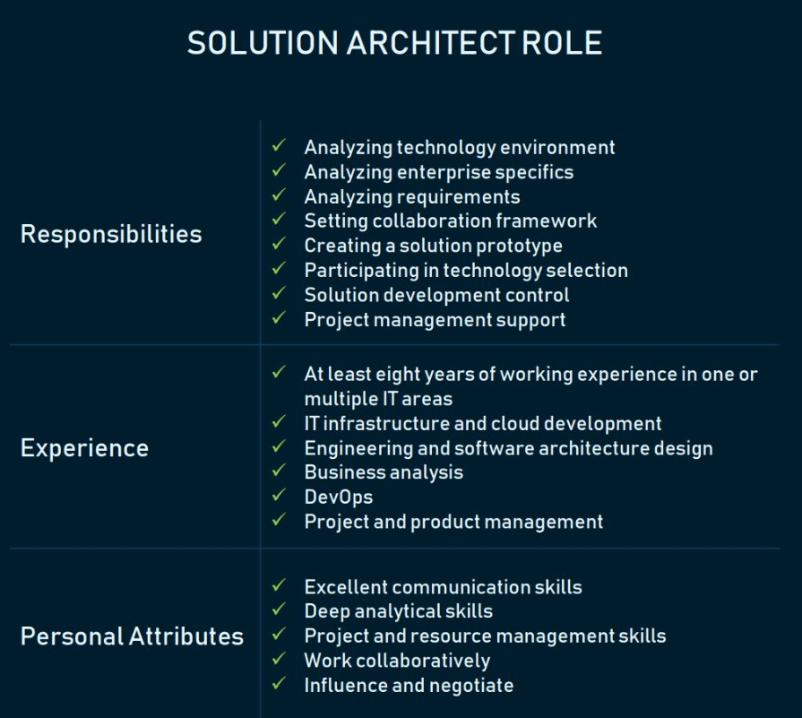

Solution Architect是做什么的：流程，角色描述，责任和成果
===
关于Solution Architect，感觉这篇文章写的比较清晰，故简单翻译整理一下。

不太字斟字酌，因为有些直译感觉怪怪的，比如“谁是解决方案架构师”，实在反应不过来。

https://www.altexsoft.com/blog/engineering/solution-architect-role/

Who is Solution Architect: Processes, Role Description, Responsibilities, and Outcomes
===
根据[2017 Project and Portfolio Management Landscape](http://info.planview.com/rs/456-QCH-520/images/2Planview_Landscape_Report_2017.pdf)总结，Planview调查的49％的公司在过去12个月内都遭遇过项目失败。

在快速变化的技术环境中，组织需要转变其流程和系统，以满足新兴的业务需求。这种数字化转型需要特定的专业知识和一系列实践，以使技术解决方案与业务目标保持一致。

解决方案架构属于在任何技术解决方案开发以前执行的最重要实践之一。在本文中，我们将讨论解决方案架构是什么，描述解决方案架构师的角色，并解释如何采用此实践帮助解决业务问题。

解决方案架构是设计，描述和管理特定业务问题解决方案工程的实践。

解决方案架构师是负责领导这种实践，并介绍特定解决方案的整体技术愿景的人。

虽然可以在内部进行管理，但也有公司提供解决方案架构咨询的服务。

我们将在本文中讨论这些术语以及它们所包含的多个方面涵义。

# 企业架构vs解决方案架构与技术架构
## 企业架构
企业架构主要专注于构建复杂的企业生态系统和解决高层战略问题。企业架构定义了业务架构的战略方向，从而使我们可以了解支持该架构所需的技术设施。

## 解决方案架构
解决方案架构（SA）是一个复杂的过程，具有许多子流程，弥补了业务问题和技术解决方案之间的差距。它包括：

* 寻找可能解决现有业务问题的最佳技术解决方案。
* 向项目利益相关者描述软件的结构，特征，行为及其他方面。
* 定义功能，阶段和解决方案需求。
* 提供定义，管理和交付解决方案的规范。

## 技术架构
技术架构主要负责工程问题和软件架构。

有些组织还专门添加了基础架构。对于在内部维护复杂硬件基础架构以支持运营的组织而言，此角色非常重要。

解决方案架构描述了在特定解决方案中如何使用不同的业务组件，信息和技术架构。 由于解决方案架构更侧重于解决特定业务问题的细节和解决方案技术，因此它为企业架构和技术架构之间提供了一个通道，后者仅关注于技术问题。 对于公司来说，一个有效的方法是将企业架构活动与解决方案和技术架构活动相结合。

# 解决方案架构的主要流程

精心构建的解决方案架构可帮助团队按时，按预算开发产品，并确保解决其旨在解决的问题。解决方案架构实际执行了哪些任务？

## 将解决方案与企业环境相匹配
通常，公司已经拥有操作系统，信息环境和集成要求。解决方案架构要确保新系统适合现有的企业环境。为此，解决方案架构师必须了解业务模型的所有部分如何协同工作，包括流程，操作系统和应用程序架构。了解这些流程后，他们才能够设计出最适合该环境的特定解决方案。

## 满足所有利益相关者的需求
软件产品开发最重要的挑战之一是满足利益相关者的需求。通常，一个产品有许多利益相关者，既有技术专家又有非技术专家。解决方案架构的目标是确保将他们所有的需求都考虑在内。而且我们必须定期向利益相关者通报产品开发流程，成本和预算。这些任务通常由解决方案架构师来完成，他将技术项目细节转换为管理和其他非技术人员都可以理解的语言。

# 考虑项目约束
每个项目都有其局限性，通常称为项目约束。包括：

* 技术
* 风险
* 范围
* 成本
* 质量
* 时间
* 资源

例如，产品所采用的技术必须符合其特定模块的需求。 项目范围是定义软件特定目标，任务，特性和功能的文档的一部分。 所有的项目也都有预算分配。

虽然这些方面本身就是约束，但每个方面都有其自身的局限性。 解决方案架构师必须了解所有这些约束，进行比较，然后做出一系列技术和管理决策，以便将这些限制与项目目标相协调。

## 选择项目技术栈
创建解决方案架构的一个重要部分是选择产品开发技术。技术架构策略将直接取决于所选的技术栈。许多不同的实践都与平台，编程语言和工具相关。这时解决方案架构的职责就是去找到一种最适合特定项目的实践，而不仅仅是普通的技术评估和比较。

## 满足非功能需求
所有软件项目都必须满足一些体现其系统特性的非功能性需求，也称为质量属性。虽然非功能性需求的确切列表取决于每个产品的复杂性，但最常见的是产品的安全性，性能，可维护性，可扩展性，可用性和可靠性。解决方案架构师的职责之一是分析所有非功能性需求，并确保进一步的产品工程能够满足这些需求。

由于我们已经讨论了解决方案架构采用的高级目标，现在我们将其细分为具体职责和基础技能组合。

# 解决方案架构师职责
解决方案架构师的工作重点是解决方案级决策，及其对整体业务目标和结果的影响分析。 解决方案架构师的职责直接源于以下实践中的过程：

* 分析技术环境
* 分析企业特性
* 分析和记录需求
* 设置协作框架
* 创建解决方案原型
* 参与技术选型
* 控制解决方案开发
* 支持项目管理

虽然这些职责中的大部分都需要解决方案架构师的领导角色，但他们只是支持PM活动，以确保资源，风险识别和计划与解决方案的最终目标保持一致。

# 解决方案架构师角色描述

如果您已经意识到解决方案架构在您的项目中的重要性，那么下一步就是为该角色寻找和雇用员工。 我们已经考虑了一个好的解决方案架构师必须具备的核心技能。

## 技术背景和经验
为了向管理和工程团队提供技术建议，解决方案架构师必须具备在一个或多个IT领域至少具有八年工作经验的技术背景，包括但不限于：

* IT架构，基础架构和云开发
* 工程和软件架构设计
* 业务分析
* DevOps
* 项目和产品管理

## 出色的沟通技巧
解决方案架构师能力的一个重要部分是沟通。考虑到这一角色需要与利益相关方进行谈判，了解各方的需求，管理风险和产品交付，缺乏沟通技巧可能会造成真正的瓶颈。该职位需要与企业和软件架构师，业务分析师及项目团队密切合作。因此，经验丰富的解决方案架构师都应该具有倾听，建议，共情和解说的能力。

## 深厚的分析能力
设计解决方案需要了解业务的不同部分如何协同工作。架构师必须认识到公司战略，并实现所有那些定义了公司如何达到其战略目标的业务流程。架构师还必须了解技术细节。所以，解决方案架构师需要不断地处理分析工作，并且在不同的业务层之间来回跳转。

## 项目和资源管理技能
虽然解决方案架构师不直接参与项目管理，但是不可避免地也要考虑项目的截止日期和给定资源。解决方案架构师必须能够决断哪些解决方案有利，哪些解决方案在特定情况下毫无价值。他们必须关注业务成果，并了解如何在给定的时间和资源下实现这些成果。

# 公司什么时候需要解决方案架构咨询
如果集成新软件系统的过程不是系统化的，那么技术咨询组织可以将解决方案架构引入公司结构。最重要的一点是，没有必要为每个项目都配置一个解决方案架构师。如果您只是实现一个已经验证过在类似环境中可行的技术模块，那么您就不需要解决方案架构师。一旦软件工程项目变得更加复杂，并且具有相当多的流程和风险，最好考虑解决方案架构咨询服务。

让我们来看看需要引进解决方案架构咨询的案例：

**您不知道哪种解决方案最适合企业生态系统。** 您需要在现有企业架构和特定项目之间建立链接。解决方案架构师将确保该解决方案符合您公司环境的标准。例如，如果您将许多现有的后台流程迁移到云，解决方案架构师将负责分析多种方案，并结合技术，人力和财务资源给出最好的建议。

**您运行数字转型项目。** 数字化转型要求企业重新考虑如何为客户提供价值或最终提供什么。如果不将技术和业务视角联系起来，就没有办法回答这些问题，而这正是解决方案架构师工作的核心。

**你面临很多风险。** 这种情形下解决方案架构师是必要的，比如项目存在许多技术风险，可能出现不确定的需求，必须同时实施多个产品，基础技术尚未得到批准。

**您必须向投资者推销产品路线图。** 如果您必须向投资者和利益相关者展示一个未来的产品，解决方案架构师将给您建议符合产品需求的技术，并以清晰平实的业务术语说明其推理论证过程。

**您需要在利益相关者和工程师之间建立沟通。** 解决方案架构师将有助于填补技术和非技术专家之间的沟通差距。此外，通过与项目管理团队合作，解决方案架构师可以覆盖产品与利益相关方需求不一致的风险，并确保解决方案符合既定目标。

**许多团队都参与了这个项目。** 您可能有一个大型项目，需要有人来管理设计师，技术或业务架构师团队，以创造高质量的技术项目成果。

# 结语
无论您是否真正采用这种实践，解决方案架构都是任何IT项目的基础。通过有意识地引入解决方案架构，您可以构建一种框架，使技术，资源和技能，与既定的业务目标保持一致。

在考虑解决方案架构之前，我们建议您探索结合了解决方案和企业层面的企业架构框架。

传统上，中小型企业既不考虑解决方案架构的实践，也不考虑各自的角色。解决方案架构问题的处理是在产品团队中的其他角色之间委派和共享的。对于具有可预测结果的小型项目来说，这是一个可行的选择。但是，如果您有一个复杂的企业架构，将多个软件产品引入一个正常运行的生态系统，您需要完全重建您的遗留软件，或制定一套战略性技术决策，那么，需要一个专业的专家，就是显而易见的了。

