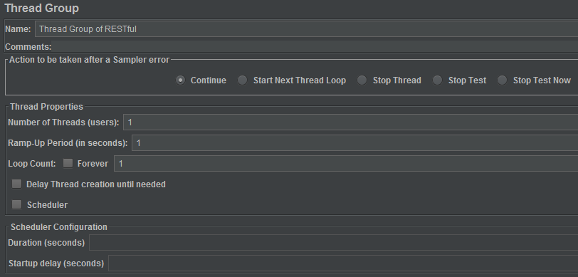
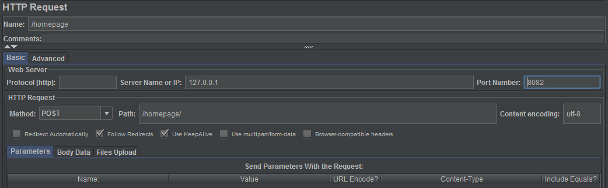

How to Test Web Service Performance With Jmeter
===
# Download & Install
Download and unzip. Run bin/jmeter.bat, will see the UI to new test plan.

https://jmeter.apache.org/

# Test Plan
## Thread Group

### Action to be taken after a Sampler error
* Continue
* Start Next Thread Loop
* Stop Thread
* Stop Test
* Stop Test Now

`Stop Test Now` will stop the whole test immediately. Any current samplers are interrupted if possible.

### Thread Properties
* Number of Threads (users)
* Ramp-Up Period (in seconds)
* Loop Count
* Scheduler
  * Duration (seconds)
  * Startup delay (seconds)

Ramp-Up Period means the time Jemter need to start the `Number of Threads`.   
`Loop Count` is for each thread, that means if we have 5 threads, with loop count 2, the service will get 10 requests totally.

### HTTP Request
Right click `Thread Group` -> `Add` -> `Sampler` -> `HTTP Request`.

Input protocol, IP, port, method, path, etc.

Insert data into `Parameters` or `Body Data`.    
If body data is required for JSON or XML, add appropriate `Content-Type` in `HTTP Header Manager`.

### HTTP Header Manager
Right click `HTTP Request` -> `Add` -> `Config Element` -> `HTTP Header Manager`.

* Test SOAP

Content-Type text/xml

* Test RESTful With JSON

Content-Type application/json

## Kick Start
Right click the thread group name and click `Start` will run tests in this thread group.

Click `Start` button in the top of the screen will run all thread group tests.

## Listener
When you just start the test and want to see the response, to double confirm if the request is feedback correctly, you can add `Listener`.

Right click the HTTP request -> `Add` -> `Listener` -> `View Result Tree`.

You can see many other Listeners also.
e.g. 

* Summary Report
* Aggregate Report
* Graph Result

After you have confirmed your service feedback is okay, you can right click `View Result Tree` to disable it, if you concern it may impact the overall test performance.

# Test in Command Line
```
jmeter -n -t my_test.jmx -l log.jtl
```

Generate HTML report
```
jmeter.bat -n -t cms-restful-homepage.jmx -l log.jtl -e -o report
```

Report dashboard overview:

https://jmeter.apache.org/usermanual/generating-dashboard.html

# Test Strategy
* Setup measurement baseline
* Integrate Jmeter Into CI Tool (Jenkins/Bamboo)
* Create Test Plan for DEV, SIT and UAT

### Questions:

* Test one service or multiple services per run?
* How many requests per service?
* How many requests per second?
