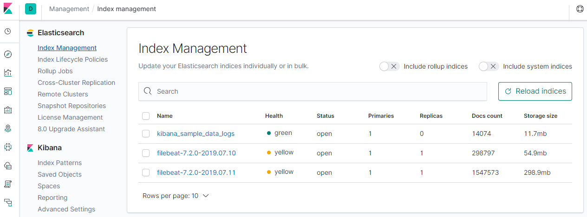

快速搭建ELK（7.2.0）
===
真正用ELK，才发现ELK的文档那么多，眼花缭乱。   
也难怪，每一个单独起来也都是挺好的小工具。   
有必要稍微梳理一下。
# Elastic Stack
- Beats
- Logstash
- Elasticsearch
- Kibana

Elasticsearch是核心搜索引擎，用于数据缓存、搜索和分析。

Beats是轻量级的数据采集器，有很多种，按需取用。

|Elastic Beats|To capture|
|-|-|
|Auditbeat|Audit data|
|Filebeat|Log files|
|Functionbeat|Cloud data|
|Heartbeat|Availability monitoring|
|Journalbeat|Systemd journals|
|Metricbeat|Metrics|
|Packetbeat|Network traffic|
|Winlogbeat|Windows event logs|

Logstash是数据收集管道，数据通过它进行归集，同时可以对经过的数据进行简单处理，如清洗过滤和润色等。

Kibana是ElasticSearch的可视化平台，提供了数据分析和监控的界面和工具集。

https://www.elastic.co/guide/index.html

# ELK架构
比较简单实用的架构应该是下面这种，Beats装在要采集数据的终端，将数据发给Logstash，再转给ElasticSearch。

Beats也可以直接发数据给ElasticSearch，但经Logstash可以先进行一些预处理。它们之间也可以进一步引入消息队列。


# ELK安装
先不管那么多，把四个软件都下载安装了再说。这里用的是解压版。
需要注意的是：要安装相同的版本。

* elasticsearch-7.2.0-linux-x86_64.tar.gz
* filebeat-7.2.0-linux-x86_64.tar.gz
* kibana-7.2.0-linux-x86_64.tar.gz
* logstash-7.2.0.tar.gz

要monitor log files，则装Filebeat。

https://www.elastic.co/guide/en/elastic-stack-get-started/current/get-started-elastic-stack.html

## Elasticsearch
直接启动会遇到如下错误。
### Can not run elasticsearch as root
不能用root用户运行，转到其他用户即可。当然该用户要有相应权限。

加参数`-d`表示在后台运行，`-p`用来输出PID，这样就可以用`pkill -F pid`来关闭程序。

```bash
chown elkusr:elkusr -R /opt/elk/
cd /opt/elk/elasticsearch-7.2.0/
sudo -u elkusr ./bin/elasticsearch -d -p pid
pkill -F pid
```

成功启动后`curl`结果如下。
```bash
curl localhost:9200
  % Total    % Received % Xferd  Average Speed   Time    Time     Time  Current
                                 Dload  Upload   Total   Spent    Left  Speed
100   507  100   507    0     0  31687      0 --:--:-- --:--:-- --:--:-- 31687{
  "name" : "appserver1",
  "cluster_name" : "elasticsearch",
  "cluster_uuid" : "DVsCk28AA5WhL2BhCtkxtw",
  "version" : {
    "number" : "7.2.0",
    "build_flavor" : "default",
    "build_type" : "tar",
    "build_hash" : "508c38a",
    "build_date" : "2019-06-20T15:54:18.811730Z",
    "build_snapshot" : false,
    "lucene_version" : "8.0.0",
    "minimum_wire_compatibility_version" : "6.8.0",
    "minimum_index_compatibility_version" : "6.0.0-beta1"
  },
  "tagline" : "You Know, for Search"
}

```
### 远程访问Elasticsearch
如果ELK组件安装在不同机上，则需要打开远程访问。

* network.host

更新network.host为0.0.0.0
```
vi /opt/elk/elasticsearch-7.2.0/config/elasticsearch.yml
#network.host: 192.168.0.1
network.host: 0.0.0.0
```

* initial_master_nodes and vm.max_map_count

这时启动会遇到如下错误。   
```
[2] bootstrap checks failed
[1]: max virtual memory areas vm.max_map_count [65530] is too low, increase to at least [262144]
[2]: the default discovery settings are unsuitable for production use; at least one of [discovery.seed_hosts, discovery.seed_providers, cluster.initial_master_nodes] must be configured

```
第一个是要提高最大线程数（max_map_count/2）。
```
echo "vm.max_map_count=262144" >> /etc/sysctl.conf
sysctl -p
```
第二个是Elasticsearch7.0以后一些discovery相关默认配置改了，添加如下配置，重启。
```
vi /opt/elk/elasticsearch-7.2.0/config/elasticsearch.yml
cluster.initial_master_nodes: ["node-1"] 
```

* 开Linux端口
```
firewall-cmd --zone=public --add-port=9200/tcp --permanent
firewall-cmd --reload
```

* 测试远程访问

用浏览器打开则返回一个JSON。
```
curl 10.119.61.108:9200
```

## Kibana
### 远程访问Kibana
Kibana是UI，远程访问肯定要开。

* server.host

```
#server.host: "localhost"
server.host: "0.0.0.0"
```

* 开Linux端口

```
firewall-cmd --add-port=5601/tcp --permanent
firewall-cmd --reload
```

### Kibana Logging配置
Kibana日志默认输出到stdout。怕有问题，可以暂时输出到文件。
```
sudo -u elkusr mkdir /opt/elk/kibana-7.2.0-linux-x86_64/logs

vi /opt/elk/kibana-7.2.0-linux-x86_64/config/kibana.yml

#logging.dest = stdout
logging.dest = /opt/elk/kibana-7.2.0-linux-x86_64/logs/

```

### Kibana Startup
```
cd /opt/elk/kibana-7.2.0-linux-x86_64
sudo -u elkusr nohup ./bin/kibana &

ps -ef|grep node
tail -f /opt/elk/kibana-7.2.0-linux-x86_64/logs/kibana.log
```

http://appserver1:5601/

## Filebeat
以下配置顺便以Kibana的日志来测试，输出到Logstash。
```
vi /opt/elk/filebeat-7.2.0-linux-x86_64/filebeat.yml
filebeat.inputs:
- type: log
  enabled: true
  paths:
    #- /var/log/*.log
    /opt/elk/kibana-7.2.0-linux-x86_64/logs/*.log


output.logstash:
  hosts: ["127.0.0.1:5044"]

cd /opt/elk/filebeat-7.2.0-linux-x86_64
sudo -u elkusr nohup ./filebeat -e &
```

## Logstash
Logstash接收Filebeat输入，然后输出到Elasticsearch。   
这里直接用logstash-sample.conf。
```
vi /opt/elk/logstash-7.2.0/config/logstash-sample.conf

# Sample Logstash configuration for creating a simple
# Beats -> Logstash -> Elasticsearch pipeline.

input {
  beats {
    port => 5044
  }
}

output {
  elasticsearch {
    hosts => ["http://localhost:9200"]
    index => "%{[@metadata][beat]}-%{[@metadata][version]}-%{+YYYY.MM.dd}"
    #user => "elastic"
    #password => "changeme"
  }
}

cd /opt/elk/logstash-7.2.0/
sudo -u elkusr nohup ./bin/logstash -f ./config/logstash-sample.conf --config.reload.automatic &
```

# 验证
打开http://10.119.61.108:5601/.  

找到Management -> Index Management，可以看到新的index：filebeat-7.2.0-2019.07.11，说明数据已经成功输入Elasticsearch。

