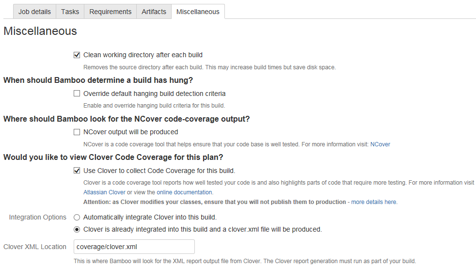
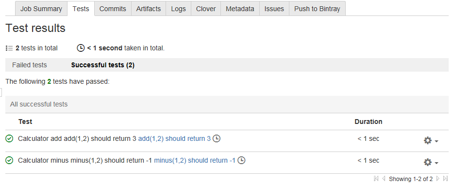
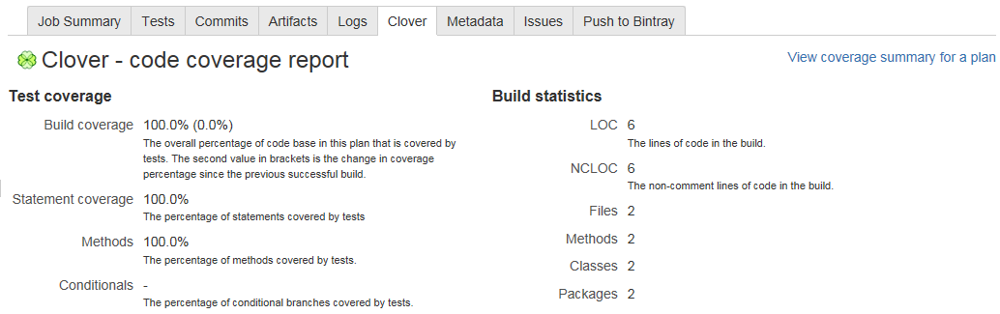

Bamboo SonarQube Node.js Integration
====
# 1. Bamboo Node.js Plugin
为Bamboo安装Node.js插件。    
https://marketplace.atlassian.com/apps/1211241/node-js-support-for-bamboo?hosting=server&tab=overview

然后添加Node.js Executable Capability，否则在Build Plan里`Add Task`的时候，将会发现Node.js Task和npm Task没有Executable可选，需要Add New Executable。        

注意：Node.js Executable的路径要配置到可执行文件名，即node.exe，npm不需要额外配置，Bamboo会根据Node.js配置得到npm.cmd的正确路径。

参考：    https://confluence.atlassian.com/bamboo/defining-a-new-executable-capability-289277164.html

# 2. Bamboo Plan
`Create a new Plan`，一个Job通常包括以下Task。
* Source Code Checkout
* Install Dependent Modules (npm install)
* Run Unit Test (npm test)
* Mocha Test Parser (接收mocha.json结果)
* Sonar Scanner
* *Parse Coverage Report (接收coverage/clover.xml)*

`Parse Coverage Report`并不是一个Task，而是可以直接在Miscellaneous里配置。


`Run Unit Test`用`npm test`而不是`Mocha Test Runner`，主要是要整合Istanbul生成Coverage Report，详细参考下一节。

参考：   
https://confluence.atlassian.com/bamboo/getting-started-with-node-js-and-bamboo-687213472.html    
https://confluence.atlassian.com/bamboo/configuring-tasks-289277036.html

# 3. Bamboo+Mocha+Istanbul
程序部分可参考：[Node.js自动化测试(Mocha+Istanbul)](https://blog.csdn.net/prufeng/article/details/83043246)

为了整合Bamboo和Mocha，需要以下插件。  
```bash
npm i -D mocha-bamboo-reporter
```
修改package.json Scripts。   
[mocha-bamboo-reporter](https://github.com/issacg/mocha-bamboo-reporter)用来生成mocha.json   
`clover`用来生成coverage/clover.xml。
```json
"test": "nyc -a --reporter=clover mocha --recursive --reporter mocha-bamboo-reporter"
```

# 4. Bamboo Run Plan

成功执行可得结果如下。

## 4.1 Test Result


## 4.2 Clover
点击`View coverage summary for a plan`可以看Summary和Historical charts。



# 5. +SonarQube
## 5.1 Clover Not Support?
Bamboo和Node.js整合完成后，已经可以在Bamboo上看到Unit Test的结果和Code Coverage报告，但是Sonar Coverage始终为0，表明该结果还没有被Sonar读取。
```
//sonar-project.properties
sonar.core.codeCoveragePlugin=clover
sonar.clover.reportPath=coverage/clover.xml
```
以上配置尝试多次还是不行，Bamboo上也没看到什么有价值的log，只好从努力到放弃。（Any idea?)

## 5.2 Lcovonly
最后发现原来支持Lcovonly，成功配置如下：
```
//sonar-project.properties
sonar.coverage.exclusions=test/**/*
sonar.javascript.lcov.reportPaths=coverage/lcov.info
```
参考：   
https://docs.sonarqube.org/display/PLUG/JavaScript+Coverage+Results+Import   
https://docs.sonarqube.org/display/SONAR/Analysis+Parameters

当然要先生成lcov report，增加以下script。

```
//package.json
"lcov": "nyc report --reporter=lcovonly"
```
Bamboo上添加相应task生成lcov report。

```
npm run-script lcov
```
至于原先的Clover配置，还是保持了，因为Bamboo对Clover支持比较好，Build完之后可以直接在Bamboo上查看，它的Historical charts看起来也很直观。
