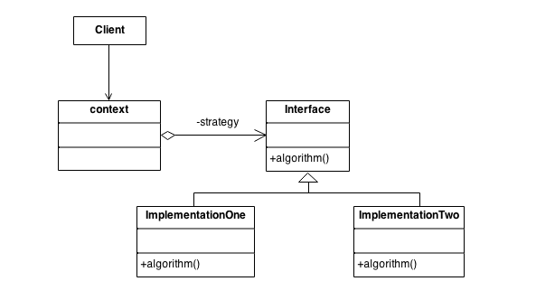

JavaScript设计模式 - Strategy
===
专职写了几个月，虽然开始有些凌乱，现在基本上也认同：JavaScript是一门优雅的语言。

从设计模式的角度，应该能更好地理解JavaScript的不同，改善既有代码。

那就先从比较常用的Strategy模式开始。

# Strategy Pattern
Define a family of algorithms, encapsulate each one, and make them interchangeable. Strategy lets the algorithm vary independently from the clients that use it. 

(From https://sourcemaking.com/design_patterns/strategy)



# JavaScript Example

* 定义一组Strategy, 确保可互相替换
* 通过替换Strategy改变程序的行为

```js
        const HelloWork = function (travelStrategy) {
            this.travelStrategy = travelStrategy;

            this.setTravelStrategy = function (travelStrategy) {
                this.travelStrategy = travelStrategy;
            };
            this.travel = function () {
                let strategy = this.travelStrategy();
                console.log(`${strategy}上班`);
            };
        };

        const walking = () => {
            return '我穷我走路';
        };
        const bike = () => {
            return '我环保我开新能源机动车（小电瓶）';
        };
        const subway = () => {
            return '我土豪我搭几个亿的地铁';
        };

        const hw = new HelloWork(walking);
        hw.travel();

        hw.setTravelStrategy(bike);
        hw.travel();

        hw.setTravelStrategy(subway);
        hw.travel();
```

Output:
```
我穷我走路上班
我环保我开新能源机动车（小电瓶）上班
我土豪我搭几个亿的地铁上班
```