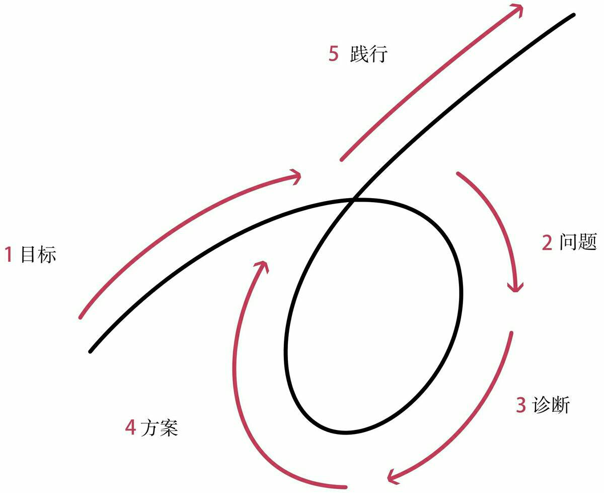

世俗的成功法则
===

>人人都有长处和短处，人人都能在生活中扮演重要角色。大自然塑造万事万物皆有目的。你最需要的勇气不是驱使你战胜别人的勇气，而是不管其他人对你有何冀望，你始终坚持做最真实的自我的勇气。   

——《原则》

读过的书中超预期的不多，《原则》算是其中一本。

想了一下，把题目定为《世俗的成功法则》，算是对过往所理解的成功学的小总结。

所谓成功，无非解决以下问题，亦即第一条原则。

>独立思考并决定：（1）你想要什么；（2）事实是什么；（3）面对事实，你如何实现自己的愿望

# 你想要什么

或许，尝试回答便已胜过许多人。   
大多数人根本不知道自己想要什么。

我也不知道。

刚毕业的时候，有人问我目标。   
我说，有一份稳定的工作，有老婆孩子，有周末可以逛的公园。

如今，一切近在咫尺。

是不是感觉已经到达了人生的巅峰？   
然而并没有。

程序员，销售，团队主管，架构师，合伙人……   
工作的部分，算是很努力地尝试了。

然而，只是一份工作。

儿子，父亲，丈夫，兄弟，朋友……   
生活的部分，仍需努力。

## 目标必须是自己的

我们这一代人（中许多人）的悲哀在于——   
没得选，   
或约等于没得选。

这是一个剧变的时代，   
我们的父母，却极少能给予有效的建议。   
比如高考时，打工时，遇到挫折时……   
很多时候，我们也根本不清楚即将面临的是什么，甚至无法与自己好好相处。

于是，只能选择责任。   
对父辈艰辛的理解和现实生活的压力，更增加了我们的迂腐和愚忠。

连电视剧里也说——   
不要大声责骂年轻人，他们会立刻辞职的，但是你可以往死里骂那些中年人，尤其是有房有车有娃的那些人。

但是责任并不是目标。

>不要混淆目标和欲望。

当我们的责任完成时，我们还能做什么？想做什么？

工作是为了养家糊口，却不仅仅是养家糊口。   
结婚是家族的大事，却又仅仅是自己的事。

年龄渐长，我们又注定会看到我们最亲爱的人，一个一个离去，却无能为力。   
人世间最大的悲痛莫过于此。

然而当他们离去时，我还是我吗？   
我是不是突然变得什么也不是？

到了不惑的年龄，却依旧不能不惑。

不管怎么说，目标必须是我们自己的。      
我是什么，要由我们自己来定义。

妈妈说，不要委屈自己。

## 目标必须是理想化的

或者说，必须赋予我们的目标一些理想化的意义。

>不要把成功的装饰误认为成功本身。

锐•达利欧的人生目标是，有意义的工作和人际关系。   

一个检验目标的好方法是，想象你的目标突然实现了，接下来该怎么办？

比如，突然实现了一个小目标，赚到了一个亿，该怎么办？

假如你的答案是继续赚钱，那赚钱本身应该可以作为目标。   
（但要注意，钱本身是没有价值的，钱的价值在于它当下可以买到的东西。）

假如你的答案是各种玩，那似乎玩才是你的真正目标。   
（此时应该专注于玩而不是那么拼命赚钱了。）

当然，也要适当地排下优先级。

>尽管你几乎可以得到你想要的任何东西，但你不可能得到你想要的所有东西。

# 事实是什么

我以为，这个简单问题的回答，决定了一个人成就的高度。

选择比努力更重要。   
而我们的所有决策，又都是基于我们所看到的事实。  

确保我们的决策总是基于客观事实，才能帮助我们大概率做出最优抉择。

>最重要的事情并不是预知未来，而是知道在每一个时间点上如何针对可获得的信息做出合理的回应。

## 真相是什么

最近关于原生家庭的话题特别火。   
为什么要摆脱原生家庭的影响？   
因为家庭生活里长期形成的某些根深蒂固的偏执，最终会使我们看不清世界的本来面目。

比如我爸就经常喜欢指导我们要怎样怎样做生意，但是事实上，在他的人生经历中，鲜有成功的经商经验。

假如按他说的去做，迟早要掉沟里。

我也至今犹记得十几年前去拜访一个亲戚长辈的场景。   
那时候我哥刚跟人合伙开了个小店，本来挺开心的进门，谁知劈头就飞来一句:

“听说你自己出去开厂了？如果是真的，那就是疯了！”

竟无言以对。

我们的父母长辈，多有严重的小农意识和小市民心态。

比如，崇尚自给自足，羞于向别人求助；   
小富即安，缺乏自律，害怕改变，懒得多向前一步；   
自私自利，贪小便宜，做事缺乏长远考虑；   
嫉妒心和虚荣心重，透支未来也忍不住要攀比……

想一想，长期在这样的环境熏陶下的我们，要多艰难才能长成自己喜欢的样子。

所以，每当我们面对现实，要时刻保持头脑极度开放、极度透明。   
多问问自己，真相到底是什么？   
我们身上可能有哪些偏见会阻碍我们认清事实？

## 客观规律是什么

这个世界上唯一不变的东西，就是变化本身。

当我们遇到一个新问题，一个好的习惯是假设自己是无知的。   
Keep foolish，keep hungry。

停止幻想——事情应该是这样的。   
多问——我怎么知道我是对的。

普遍的规律是什么？   
有哪些科学的分析方法和系统框架？  
成功的人和案例在哪里？

符合客观规律的，才可能是对的。   
确保总是用可信度加权的方法来进行决策。

# 怎么办

一个人不可能两次踏进同一条河流，但是每一条河流都是相似的。

锐•达利欧提出了五步流程的方法，来帮助我们实现螺旋向上的人生。

这其实并不是什么新理论。   
它类似于质量管理的PDCA，即计划（Plan），执行（Do），检查（Check），处理（Action）。   
也类似于软件工程里的迭代开发，一次次循环塑造出更满意的产品。

## 五步流程

1．有明确的目标。   
2．找到阻碍你实现这些目标的问题，并且不容忍问题。   
3．准确诊断问题，找到问题的根源。   
4．规划可以解决问题的方案。   
5．做一切必要的事来践行这些方案，实现成果。

## 如何提高效率

五步流程简单易行，只需像机器一样执行。   

把决策和执行的过程都变成可以清晰描述的算法，把所有事情系统化流程化和自动化。

简单来说，就是要按原则做事。

### 按原则做事

就像时间管理技术教给我们的，在固定的时间做特定的事情。   
按原则做事，相当于提前想好，遇到什么事情做出何种反应。

生活中大多数的事情都是重复发生的，也就意味着，我们只需要很少的时间处理大多数事情，而可以把大多数时间花在比较难（有趣）的地方。

现在人们已经把许许多多重复的事情都交给了机器人。

不过身边为一件小事反复纠结的人还真不少。   
明明几分钟就可以决定的事情，却犹犹豫豫，迁延时日，甚至夜不能寐。

应该仔细分析问题出在哪里。

如果缺少资料，就要大力搜集事实信息。

过于复杂则可以进一步分解，每一部分分别分析，再加权汇总。

每一个人的原则各不相同，需要一点一滴积累，从错误中学习，向其他人学习。

### 不容忍问题

不容忍问题，才能真正地坚持原则。

痛苦是一个人潜在的成长机会。    
你将有机会获取新的经验，放入你的原则工具箱。   
你处理问题的原则也将越来越丰富（强大）。   

就像舞台上的主持人，已经为最尴尬的情形做好彩排，就不会再有什么意外发生。

理解和应对不好的东西才是更重要的，好的东西会自己照顾自己。

总是为最糟的情况做好准备，便能常常超越预期，越来越好。

>自然的一项根本法则是，为了赢得力量，人必须努力突破极限，而这是痛苦的。

当真相与愿望不符时，大多数人抗拒真相，逃避痛苦。

但是，没有痛苦就没有收获。

我们的潜意识倾向于把一切不了解不愉快的东西都视为威胁。
你应该遵从理智——更高级的你，直面问题，不逃避问题。

甚至，培养＂从犯错中学习的愉悦感＂。

>如果你能养成一种习惯，面对精神痛苦时能够自动地反思痛苦而不是躲避痛苦，你将能够快速地学习和进化。直面你的问题、错误和弱点导致的痛苦现实，会大幅提高你的效率。

### 与人合作

>成功有两条路：（1）自己拥有成功所需的要素；（2）从其他人那里得到成功所需的要素。

当我们在一个陌生的地方迷路了，我们知道最好的选择的是向其他人求助。
但是在生活中遇到的很多问题，我们都更倾向于自己解决。

比如，我们会担心别人觉得自己无知，也可能刚刚在他人面前夸下海口……
总是因为这样那样的原因羞于启齿。

因为担心自我形象，让别人的看法，成为自己的障碍，事后来看，都是很愚蠢的。
屈服于潜意识的情绪，就相当于放弃了选择，把一切都交给更低级的自己。

当你可能有情绪的时候，先不要做判断，不要只考虑直接结果，要考虑后续与再后续的结果。
特别是，当有多个可信的人都说你错了，那就要认真考虑自己是不是真的错了。

比起目标的达成，我们是不是总是正确的，是不是总是由我自己来完成的，并没有那么重要。

每个人都有弱点，都有自我意识障碍和思维盲点。

>大多数人犯下的最大错误是不客观看待自己以及其他人，这导致他们一次次地栽在自己或其他人的弱点上。

我们也没有足够的精力了解所有的事实。

>与你知道的东西相比，能不能妥善处理“不知道”才是更重要的。

认识人与人的不同，才能真正从他人角度看问题。

与目标一致的人一起合作，才可能找到事实上最好的解决方案，而不只是你可以想得到的最好方案。

愿我们都有勇气做出最好的抉择，成为最真实的自己。

