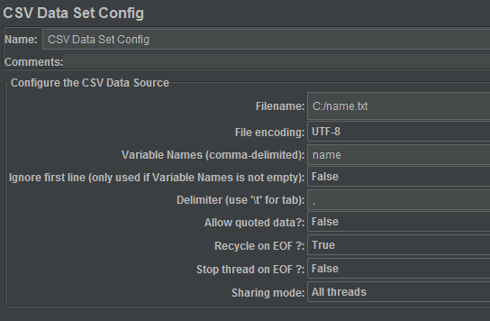

JMeter测试动态参数API
===
使用JMeter进行压力测试时，有可能需要为每次请求传递不同的参数。

如`/testFn/name/张三`，需要替换掉张三，测试100次，每次请求都使用不同的名字。

这个需求可以通过`CSV Data Set Config`，从CSV文件读取参数变量实现。

# 从文件读取

## HTTP Request
首先将Path从

`/testFn/name/张三`

改为

`/testFn/name/${name}`

## CSV Data Set Config
然后Thread Group下`Add` -> `Config Element` -> `CSV Data Set Config`。


当执行测试时，${name}将被从CSV文件中读出来的具体名字代替。

文件内容只包含一列，形式如下。（也可包含多列，同时支持多个变量，以逗号分隔。）
```
黄立冲
黄立川
黄立春
黄立达
黄立丹
黄立德
黄立东
黄立冬
黄立栋
黄立凡
```

CSV名字列表会被循环使用，即当测试次数(Number of Threads * Loop Count) > CSV名字数量时，名字参数将会出现重复。

# 其他参数变量定义方法
- JMeter内置函数
- User Defined Variable
- 从数据库读取
- 从前面请求的相应数据提取
