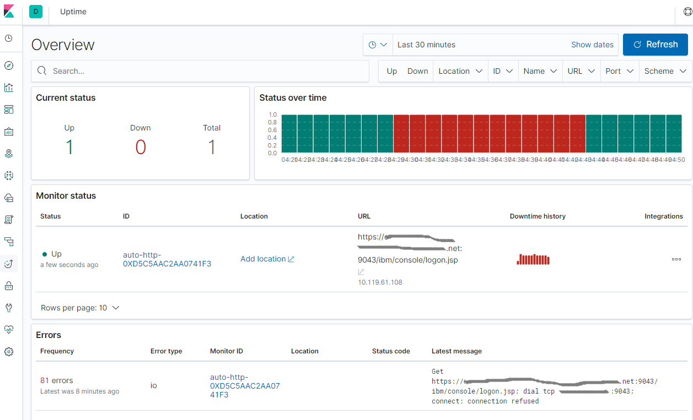

ELK - Hearthbeat实现服务监控
===
Hearthbeat，心跳，顾名思义，Hearthbeat可以用来定时探测服务是否正常运行。

Hearthbeat支持ICMP、TCP 和 HTTP，也支持TLS、身份验证和代理。

Hearthbeat能够与Logstash、Elasticsearch和Kibana无缝协作。安装Hearthbeat，添加需要监控的服务，配置好Elasticsearch和Kibana，即可将结果输出到Elasticsearch，并在Kibana显示出来。

Kibana无须再配置Dashboard，直接点击`Uptime`菜单即可看到结果。

Elasticsearch和Kibana的安装可参考：[快速搭建ELK（7.2.0）](https://blog.csdn.net/prufeng/article/details/95733467)
# 下载
```bash
curl -L -O https://artifacts.elastic.co/downloads/beats/heartbeat/heartbeat-7.2.0-linux-x86_64.tar.gz
tar xzvf heartbeat-7.2.0-linux-x86_64.tar.gz -C /opt/elk/
```

# 配置
```bash
cd /opt/elk/heartbeat-7.2.0-linux-x86_64/
vi heartbeat.yml
```
比如通过简单地探测console url来监控Websphere是否正常运行。

监控TCP可参考注释里的例子。Schedule表示每10秒监测一次。

```yml
# Configure monitors inline
heartbeat.monitors:
- type: http

  # List or urls to query
  urls: ["https://dummy.hostname.net:9043/ibm/console/logon.jsp"]

  # Configure task schedule
  schedule: '@every 10s'

#- type: tcp
  #hosts: ["192.168.1.101:1414"]
  #schedule: '@every 10s'


setup.kibana:

  # Kibana Host
  # Scheme and port can be left out and will be set to the default (http and 5601)
  # In case you specify and additional path, the scheme is required: http://localhost:5601/path
  # IPv6 addresses should always be defined as: https://[2001:db8::1]:5601
  host: "localhost:5601"

output.elasticsearch:
  # Array of hosts to connect to.
  hosts: ["localhost:9200"]
```

# 启动

```bash
chown elk:elk -R /opt/elk/heartbeat-7.2.0-linux-x86_64/
sudo chmod o+rx -R /opt/elk/heartbeat-7.2.0-linux-x86_64/

sudo -u elk ./heartbeat setup

sudo -u elk nohup ./heartbeat -e &
```

# 验证
* Open http://localhost:5601/
* Go to Uptime.
* 重启被监控服务



