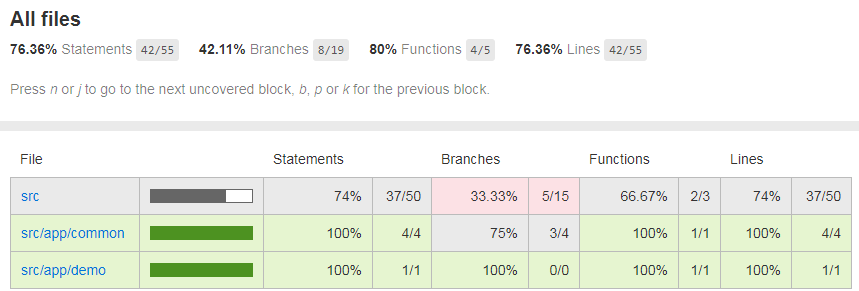

使用Mocha、Istanbul和Chai实现TypeScript单元测试和覆盖率
====
本文主要描述使用Mocha、Istanbul和Chai实现TypeScript单元测试和覆盖率的方法和过程，并简单记录SonarQube的相关配置。

Github: https://github.com/prufeng/tsexpress

关于JavaScript的单元测试和覆盖率，可参考：[使用Mocha和Istanbul实现Node.js单元测试和覆盖率](https://blog.csdn.net/prufeng/article/details/83043246)   

# Install
安装相关module和types。   
Mocha是基本单元测试工具。   
nyc用来统计代码覆盖率。   
Chai则主要用来测试HTTP request。

```
npm i -D mocha
npm i -D nyc
npm i -D chai
npm i -D chai-http
npm i -D source-map-support

npm i -D @types/mocha
npm i -D @types/chai
npm i -D @types/chai-http
```
# Mocha
## mocha.opts
创建test/mocha.opts，配置如下。
```
--require ts-node/register
--require source-map-support/register
--recursive
--full-trace
--bail
test/**/*.spec.ts
```
## app.spec.ts
创建test/app.spec.ts，添加以下test case测试当前的几个RESTful API。

```typescript
import chai from 'chai';
import chaiHttp from 'chai-http';
import server from '../src/server';

let should = chai.should();
chai.use(chaiHttp);

describe('App Unit Test', () => {
    it('should get status 200', (done) => {
        chai.request(server)
            .get('/')
            .end((err, res) => {
                res.should.have.status(200);
                done();
            });
    });
    it('should get user list', (done) => {
        chai.request(server)
            .get('/users')
            .end((err, res) => {
                res.should.have.status(200);
                res.text.should.eql('respond with the user list here');
                done();
            });
    });
    it('should get status 404', (done) => {
        chai.request(server)
            .get('/wrongUrl2018')
            .end((err, res) => {
                res.should.have.status(404);
                // res.text.should.eql('respond with the user list here');
                done();
            });
    });
});

```
## Unit Test
运行mocha命令，测试通过的结果如下。

```
mocha

  App Unit Test
GET / 200 13.293 ms - 198
    √ should get status 200
GET /users 200 0.662 ms - 31
    √ should get user list
GET /wrongUrl2018 404 7.099 ms - 1339
    √ should get status 404


  3 passing (55ms)
```
# Istanbul(nyc)
## package.json
修改package.json，增加nyc相关配置。   
`include`和`extesion`包含需要测试的source code，`reporter`指明需要生成的report，缺省为text。

```json
  "scripts": {
    "start": "npm run serve",
    "serve": "node dist/out-tsc/server",
    "test": "nyc mocha",
    "build":"tsc -p tsconfig.json"
  },
  "nyc": {
    "include": [
      "src/**/*.ts",
      "src/**/*.tsx"
    ],
    "exclude": [
      "**/*.d.ts"
    ],
    "extension": [
      ".ts",
      ".tsx"
    ],
    "require": [
      "ts-node/register"
    ],
    "reporter": [
      "text",
      "html"
    ],
    "sourceMap": true,
    "instrument": true,
    "all": true
  },
```

## npm test
`npm test`实际上是运行`nyc mocha`，但直接运行`nyc mocha`得不到正确的结果，因为无法加载package.json里的nyc配置。   
成功运行后参考结果如下。

```
--------------------|----------|----------|----------|----------|-------------------|
File                |  % Stmts | % Branch |  % Funcs |  % Lines | Uncovered Line #s |
--------------------|----------|----------|----------|----------|-------------------|
All files           |    79.03 |    36.84 |    85.71 |    79.03 |                   |
 src                |       74 |    33.33 |    66.67 |       74 |                   |
  app.ts            |      100 |      100 |      100 |      100 |                   |
  server.ts         |    56.67 |    33.33 |    66.67 |    56.67 |... 70,72,73,74,76 |
 src/app/common     |      100 |       50 |      100 |      100 |                   |
  errHandler.ts     |      100 |       50 |      100 |      100 |               7,9 |
 src/app/demo       |      100 |      100 |      100 |      100 |                   |
  homeController.ts |      100 |      100 |      100 |      100 |                   |
  userController.ts |      100 |      100 |      100 |      100 |                   |
--------------------|----------|----------|----------|----------|-------------------|
```
如果生成了html report，可在coverage目录下打开index.html。html report的好处是可以点击查看每个文件的具体测试覆盖详情。


# SonarQube
## Install SonarQube Plugin - SonarTS
https://docs.sonarqube.org/display/PLUG/SonarTS

## sonar.properties
```
sonar.javascript.lcov.reportPaths=coverage/lcov.info
sonar.typescript.lcov.reportPaths=coverage/lcov.info
```
(Works without sonar.typescript.lcov.reportPaths configure from my test. )

# Reference
https://istanbul.js.org/docs/tutorials/typescript/

