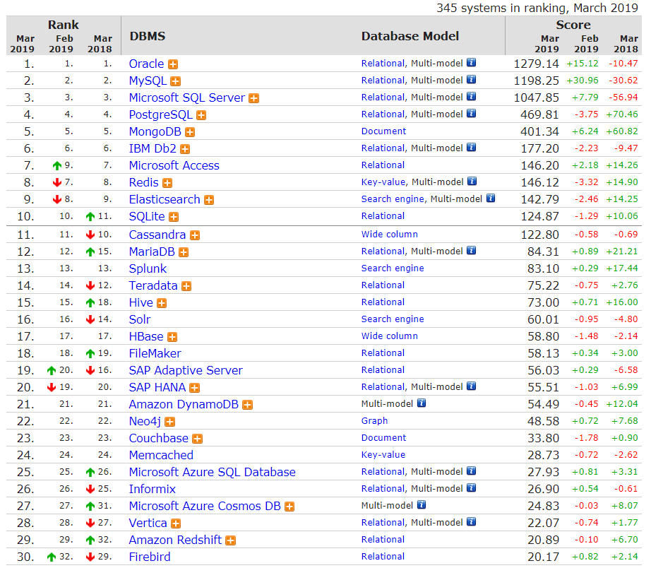

最受欢迎数据库排行榜
===

https://db-engines.com/en/ranking

主要评价维度：
* 网站提及次数(Google, Bing, Yandex)
* Google Trend
* 技术论坛(Stack Overflow, DBA Stack Exchange)
* 招聘(Indeed, Simply Hired)
* 简历(LinkIn, Upwork)
* 社交网络(Twitter)

